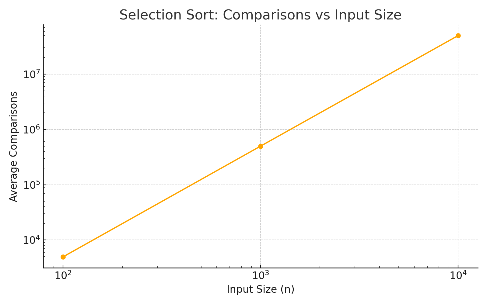
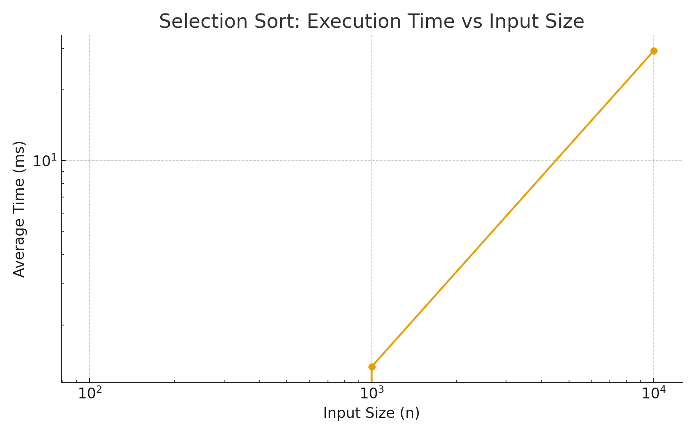
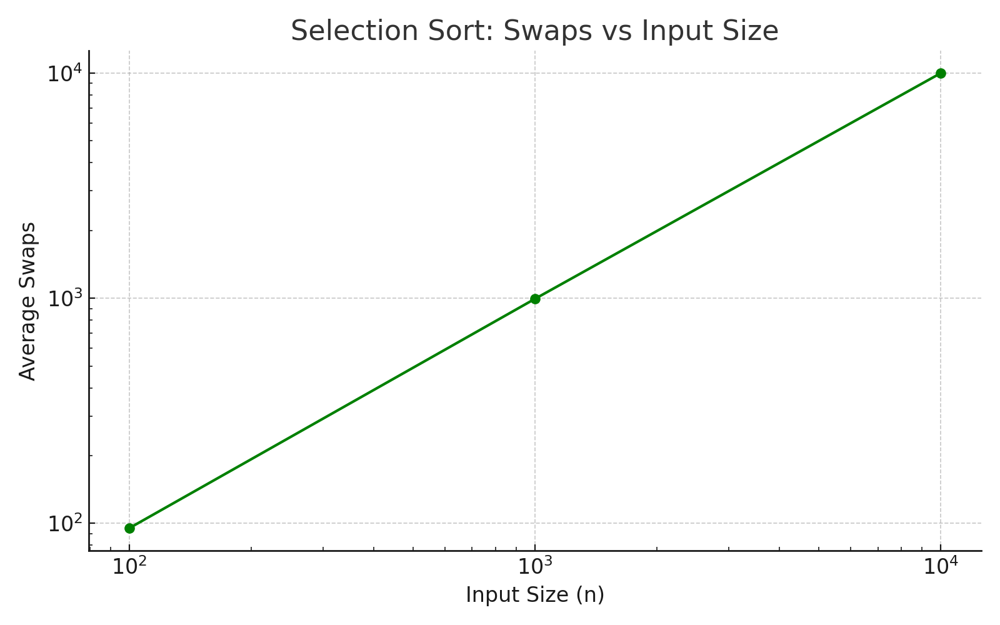

# Algorithm Performance Analysis

This project focuses on analyzing the performance of classic sorting algorithms using experimental metrics such as the number of comparisons, swaps, and elapsed execution time.  
All results are collected automatically and visualized through performance plots.

---

## Overview

The goal of this assignment was to implement and evaluate sorting algorithms in terms of time and operation complexity.  
Performance was measured for different input sizes (`n = 100`, `1000`, `10000`) over multiple trials.

Metrics recorded:
- **Comparisons** – number of element comparisons
- **Swaps** – number of exchanges between elements
- **Elapsed (ms)** – execution time in milliseconds

---

## Experimental Results

| Algorithm      | n     | Trial | Comparisons | Swaps | Elapsed (ms) |
|:----------------|------:|-------:|-------------:|-------:|---------------:|
| SelectionSort  | 100   | 1      | 4,950        | 95    | 0 |
| SelectionSort  | 100   | 2      | 4,950        | 96    | 0 |
| SelectionSort  | 100   | 3      | 4,950        | 95    | 0 |
| SelectionSort  | 1,000 | 1      | 499,500      | 995   | 3 |
| SelectionSort  | 1,000 | 2      | 499,500      | 996   | 0 |
| SelectionSort  | 1,000 | 3      | 499,500      | 992   | 1 |
| SelectionSort  | 10,000 | 1     | 49,995,000   | 9,992 | 29 |
| SelectionSort  | 10,000 | 2     | 49,995,000   | 9,991 | 30 |
| SelectionSort  | 10,000 | 3     | 49,995,000   | 9,989 | 29 |

---

## Performance Plots

The following graphs show how execution time and operation counts scale with input size.




---

## Conclusion

Selection Sort demonstrates a predictable **O(n²)** growth in both comparisons and swaps.  
Even though its behavior is stable, it becomes inefficient for large input sizes.  
This analysis highlights the importance of choosing more optimal algorithms (e.g., QuickSort or MergeSort) for large datasets.

---

## How to Run

To reproduce results and plots:
```bash
mvn clean test
python scripts/performance_plots.py
